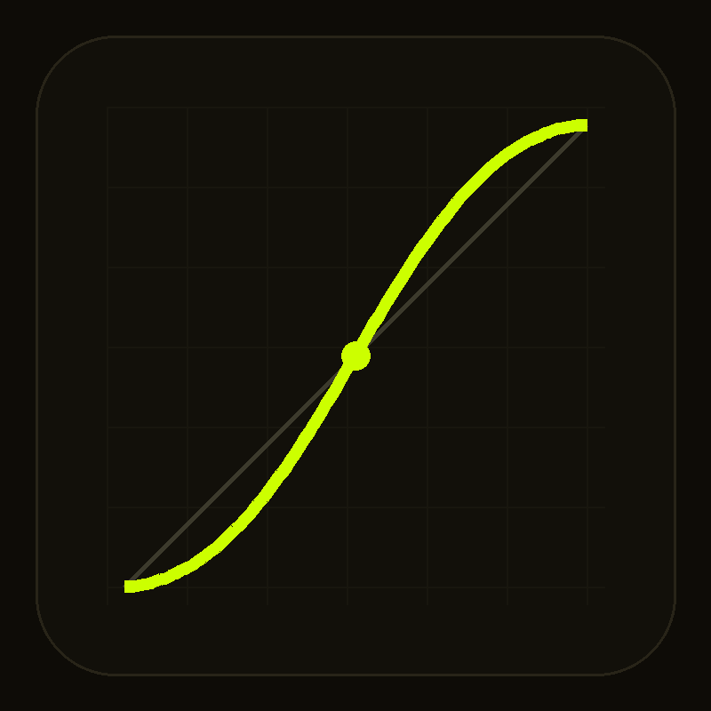
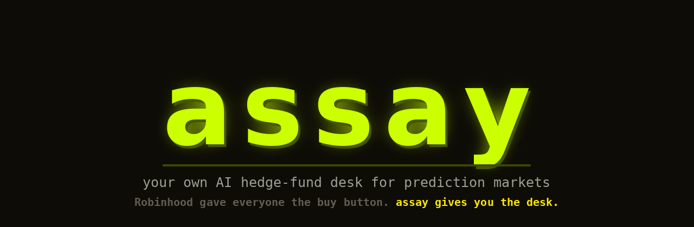
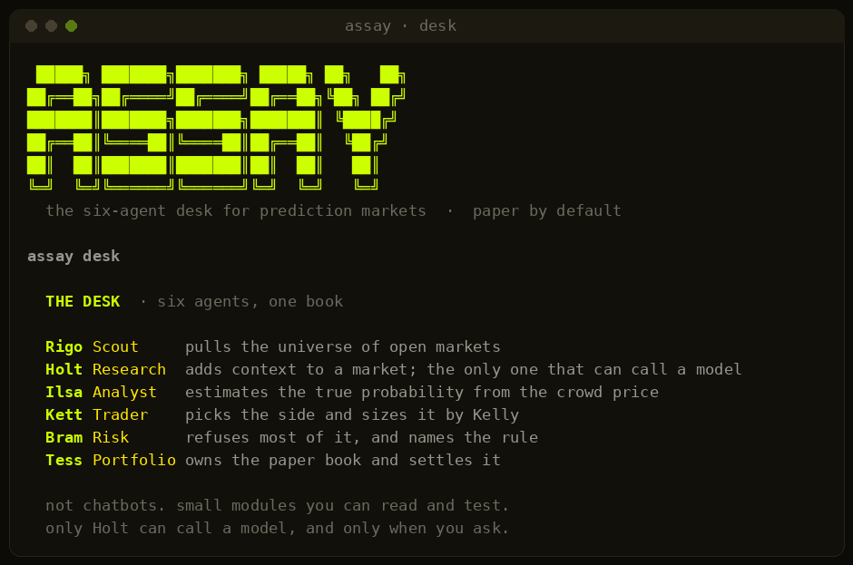
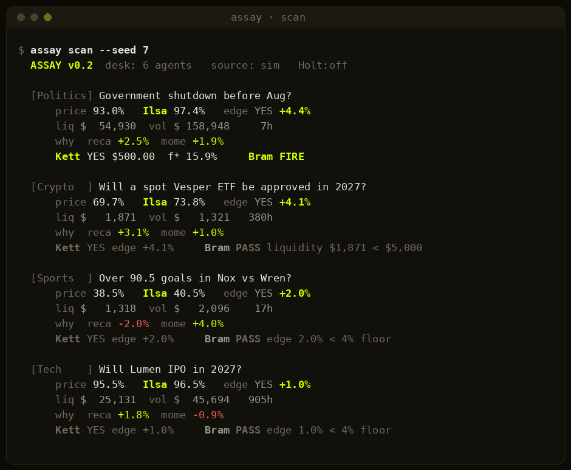
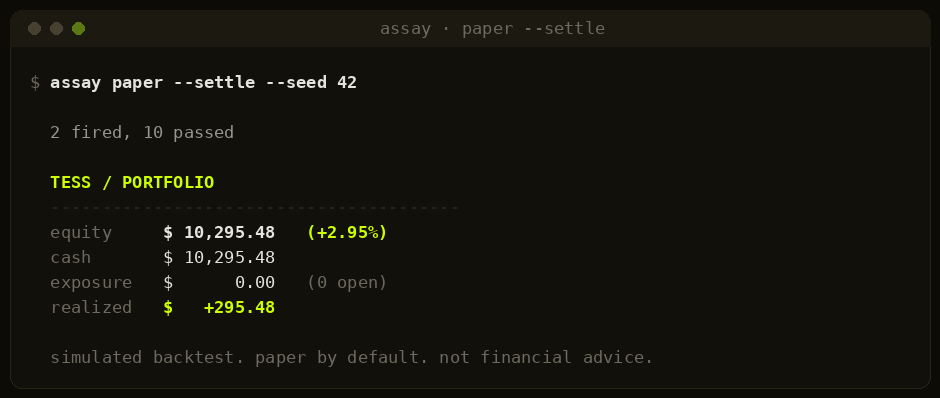
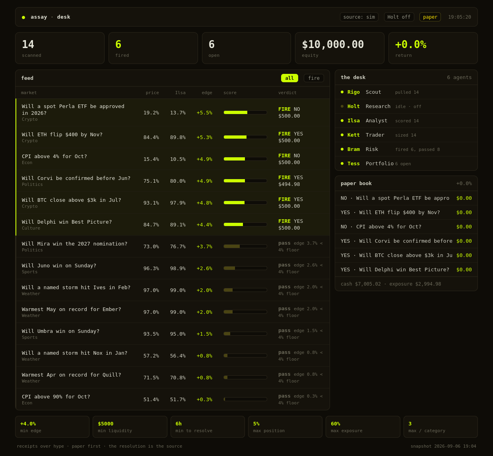
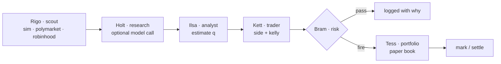

<p align="center">
  
</p>



# assay

`your own AI hedge-fund desk for prediction markets`


Robinhood gave everyone the buy button. A real fund is the rest of the desk
behind that button: someone who finds the markets, someone who estimates the
real odds, someone who sizes the bet, someone whose whole job is to say no,
and someone who owns the book. assay is that desk, six small agents, running
on prediction markets a retail account can actually reach.

It reads a market in one pass, estimates the true probability with a model
you can read line by line, sizes the bet by Kelly, runs it past a risk agent
that refuses most of what reaches it, and books it on paper. Local, open,
paper by default, reproducible by default.

It is not an AI that presses BUY. It is a desk of six agents, and most of
what the desk does is decline.

## The desk



| Agent | Role | Module | Job |
| ----- | ---- | ------ | --- |
| **Rigo** | Scout | `sources/*` | pulls the universe of open markets |
| **Holt** | Research | `research.py` | adds context; the only agent that can call a model, and only when you ask |
| **Ilsa** | Analyst | `model.py` | estimates the true probability from the crowd price |
| **Kett** | Trader | `edge.py` | picks the side and sizes it by Kelly |
| **Bram** | Risk | `risk.py` | refuses most of it, and names the rule |
| **Tess** | Portfolio | `book.py` | owns the paper book and settles it |

These are not chatbots passing English to each other. Each agent is a small
function you can open, read in a minute, and test on its own. The names give
the pipeline a face for the story. The code underneath is boring so it can be
trusted. Only Holt can call a model, and only with `--research llm`.

## What the desk does

| The problem | Which agent | How |
| ----------- | ----------- | --- |
| the crowd is right most of the time | Bram | fires nothing until the edge clears a floor, then names the rule that let it through |
| longshots are overbet, favorites underbet | Ilsa | recalibrates the crowd price in logit space by one auditable slope |
| "how big do I bet an edge this thin?" | Kett | quarter-Kelly on the edge, then a hard per-market cap, so one wrong estimate cannot compound |
| an AI that only ever buys | Bram | refuses on edge, liquidity, time to resolve, position size, exposure and correlation |
| "did the edge pay, or did I get lucky?" | Tess | settles every paper position against ground truth and reports the run, then the spread over 500 runs |
| trusting a black box with real money | all | zero dependencies, no wallet code, every number traceable to the agent that made it |

---

## Install

Python 3.10 or newer. Nothing to compile, nothing to install for the core.

```bash
git clone https://github.com/bl888m/assay && cd assay
pip install -e .          # optional, just to get the `assay` command on PATH
```

```bash
python -m assay desk      # or run in place, no install
```

The core is standard library only. The optional network paths
(`--source polymarket`, `--source robinhood`, `--research llm`) use `urllib`
from the stdlib too, so the runtime dependency count stays at zero. That is
the point: less to audit before you trust it.

## Sixty seconds

```bash
python -m assay desk                     # meet the six agents
python -m assay scan                      # read markets, score them, fire nothing
python -m assay paper --settle            # run the desk, settle by ground truth
python -m assay board                     # render the desk as a local web page
python -m assay scan --source polymarket  # score live Polymarket markets
python -m assay scan --source robinhood   # point Rigo at Robinhood event contracts
python -m assay scan --research llm        # wake Holt up (needs ANTHROPIC_API_KEY)
python tests.py                            # 22 checks, no network
```

---

## scan

Rigo pulls the markets, Ilsa scores each one, Kett sizes it, Bram gives the
verdict. `scan` shows all of that and opens nothing. Every number is either
read from the market or produced by an agent you can open and read.



The `why` line is the model in two numbers: how far Ilsa's favorite-longshot
recalibration moved the price, and how far the momentum tilt did. With Holt
on, a third `research` number and its one-line reason join them.

## paper

The full desk. Tess opens positions in a paper book; `--settle` then resolves
each one against the simulator's hidden ground truth, the only honest way to
ask whether the edge paid or you got lucky.



Against a live source there is no ground truth to settle, so Tess marks open
positions at the current quote and realises P&L only when a market resolves.

## board

The same run, drawn as a desk. `assay board` writes a snapshot and opens a
local page: the scored feed with score bars, the six agents and their status,
the paper book, and the live risk rules. It binds nothing and buys nothing; it
is a view of one paper run, the same numbers the terminal prints.



The page is plain HTML, CSS and JavaScript with no build step and no server:
the snapshot loads from a file, so opening it is a double-click. Press `f` to
filter the feed to fires only.

---

## How it works



The estimate, the sizing math, and the reasons a trade was refused, the parts
of a fund that are usually hidden, are each one short file. Full detail in
[docs/STRATEGY.md](docs/STRATEGY.md); what can go wrong in
[docs/SAFETY.md](docs/SAFETY.md).

## The estimate

Ilsa starts from the crowd price and moves off it for two reasons only, both
in [`assay/model.py`](assay/model.py), about forty lines.

**1. Favorite-longshot recalibration.** Longshots are overbet and favorites
underbet, one of the most replicated findings in betting markets. Ilsa
corrects it by stretching the price in logit space by a single slope
`k = 1.18`, pulling longshots down and favorites up.

```
q = sigmoid( logit(price) * 1.18 )
```

**2. A momentum tilt**, capped at four points so it can never overrule the
recalibration.

With `--research llm`, Holt adds a third component: a language model reads the
market and returns a probability, its vote capped like momentum and printed
with its reason. It tilts a call, never dictates one. Research off, the
estimate is only the two lines above. No hidden state, no unfalsifiable
confidence score.

## The sizing

For a binary contract that costs `p` and pays 1, buying YES has

```
kelly f* = (q - p) / (1 - p)
```

Kett bets a fixed fraction of full Kelly, quarter by default, then Bram caps
any single market at 5% of the bankroll. Full detail and the risk table in
[docs/STRATEGY.md](docs/STRATEGY.md).

## Numbers behind the defaults (simulated)

Across **500 seeded runs**, 120 markets each, default rules:

| | |
| --- | --- |
| positions per run | 12.3 on average |
| mean return | +2.68% |
| median return | +3.40% |
| standard deviation | 8.14% |
| runs in profit | 66% |
| best / worst run | +20.7% / -27.6% |

The spread is the honest part. A thin edge over a dozen bets is high variance:
a third of runs lose even when the edge is real and known. Any version of this
that shows a smooth line going up is lying to you. These come from the offline
simulator, which bakes the target bias into its ground truth, not from live
trading.

## Tests

```bash
python tests.py
```

Twenty-two checks, no network: the logit round trip, that recalibration pushes
favorites up and longshots down and leaves a coin flip alone, the momentum and
research caps, the Kelly formula, that sizing picks the right side and refuses
a zero edge, every risk refusal, that a winning YES pays out and a losing one
does not, that the desk has six agents and research is off by default, and that
the simulator and pipeline are deterministic for a seed.

## The idea

Robinhood made investing accessible to everyone. The next question is what
happens when everyone gets the desk that sits behind an investment, not just
the buy button. A real fund is a chain of specialists. assay is that chain,
small enough to read top to bottom, running on markets a retail account can
reach.

The point is not that a script beats the market. The point is that the parts
of a fund that are usually hidden can be written down in a few hundred lines
anyone can audit and argue with, and that the honest answer to "does it work"
is a settle report with a wide spread, not a screenshot of a line going up.

## FAQ

**Is this trading real money?** No. Paper by default, no wallet or exchange
code in the repo, and no `--live` flag, because the executor is deliberately
left out. See [docs/SAFETY.md](docs/SAFETY.md).

**Are the agents real, or just names?** Both. Each is a real, separate module
you can read and test. Only Holt can call a model, and only when you ask. The
rest is arithmetic.

**Is the estimate an AI black box?** No. Two lines by default, a logit
recalibration and a capped momentum tilt, both printed on every card. Holt is
optional and its vote is capped and labelled.

**Does it beat the market?** Unknown, and a dozen thin-edge bets is high
variance, so a third of runs lose even when the edge is real. That is why paper
mode and the settle report exist.

**Can I point it at Robinhood?** Yes. `--source robinhood` maps Robinhood
event contracts into the same pipeline once you set `RH_API_BASE`. It still
only reads, and never places an order.

## Built on

| Source | What was taken |
| ------ | -------------- |
| the favorite-longshot literature | the direction and rough size of the recalibration |
| the Kelly criterion | the position-sizing formula and the fractional haircut |
| [Polymarket Gamma API](https://docs.polymarket.com) | the live market shape for the public source |

assay is independent of Robinhood and Polymarket and uses none of their marks.
Nothing here is financial advice. It is a research toy for reasoning about
mispriced probabilities, and it should stay on paper.

## License

MIT. Keep it on paper.


